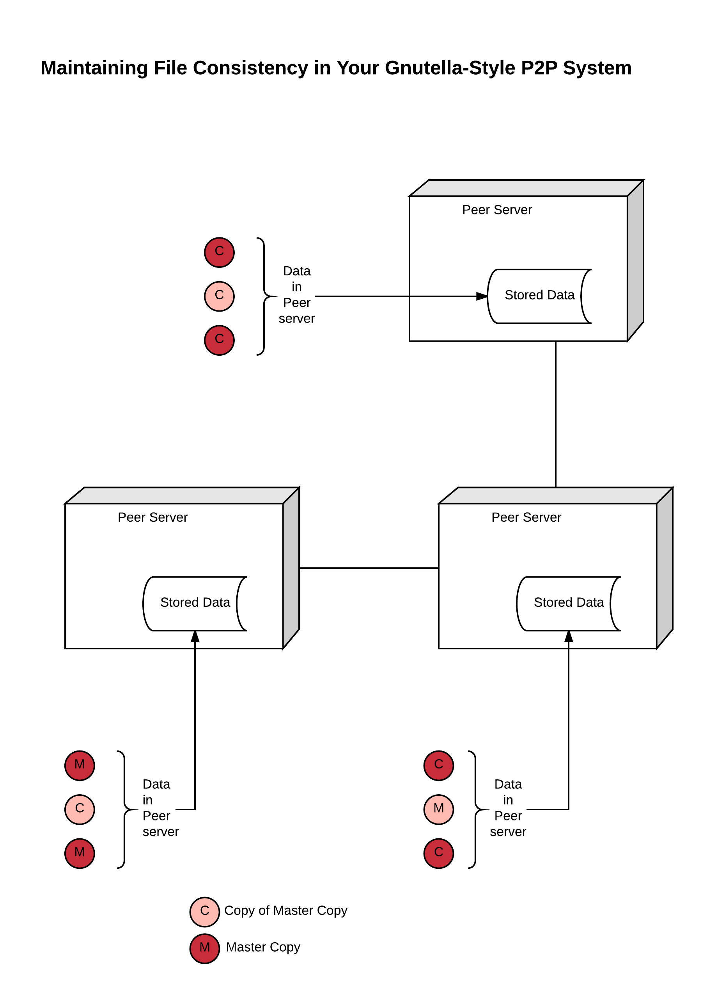
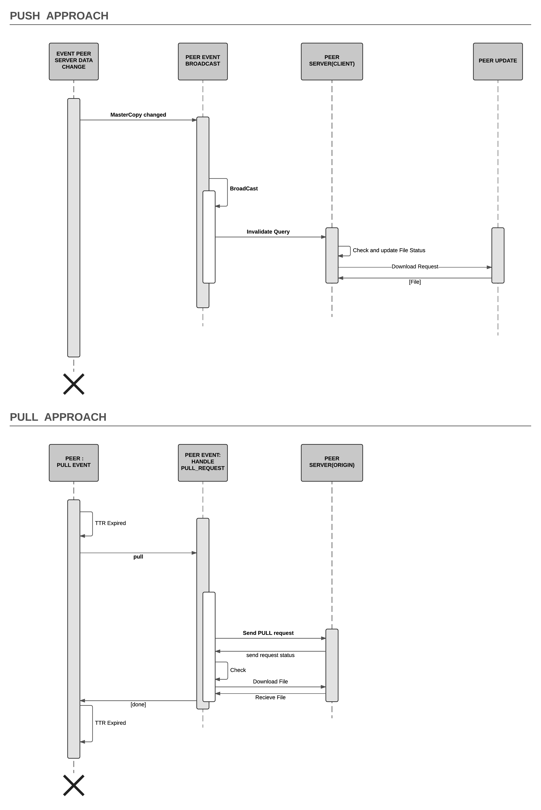
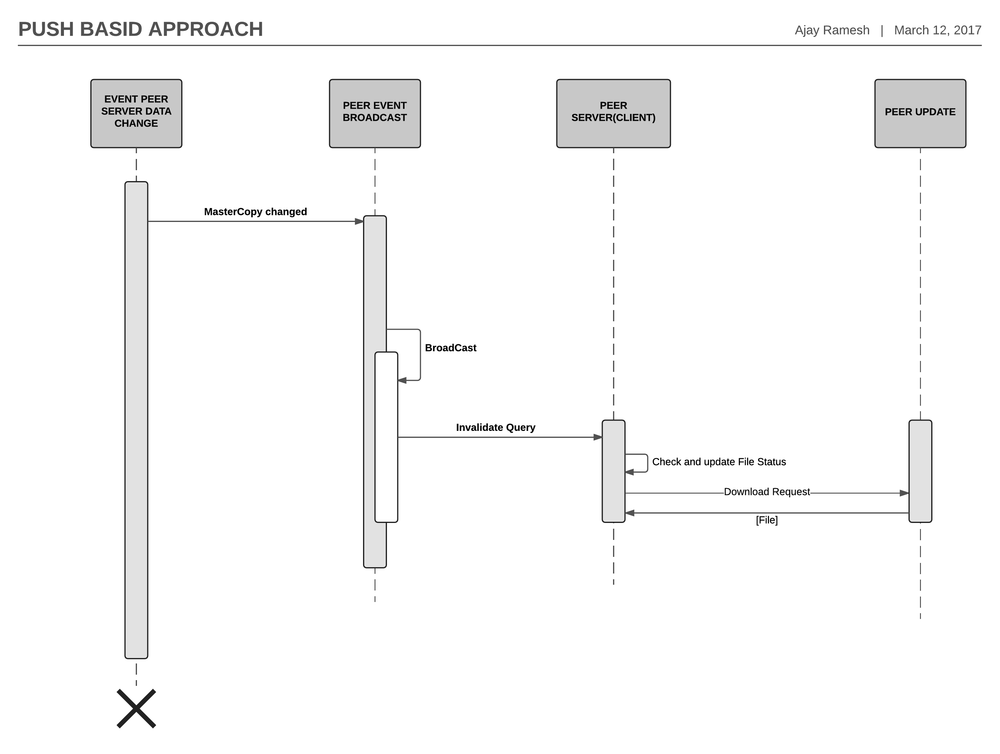

----
## PA3 Logs






### To create Jar file
```
mvn package
```


### To run Jar file
```
java -jar FileSharingSystem-1.0-SNAPSHOT.jar
```


### To see jar contents
```
java tf FileSharingSystem-1.0-SNAPSHOT.jar

```

## Simple Test case

1. Run Index Sever at port 5000
2. Run 3 Peer Server at 6000,6100,6200
3. add common files in folders peer_6000,peer_6100,peer_6200
4. add uncommon files in folders peer_6000,peer_6100,peer_6200
5. Select look up option, entire file name common,you will see the list of files and available peer address
6. Select option two to download file, enter the file name
7. It will download to your peer folder.
8. give a file name to register, it will register it.
9. Search the new registered file .
